# recmetrics
A python library of evalulation metrics and diagnostic tools for recommender systems.

_**This library is activly maintained. My goal is to continue to develop this as the main source of recommender metrics in python. Please submit issues, bug reports, feature requests or controbute directly through a pull request. If I do not respond you can ping me directly at longoclaire@gmail.com **_

|Description|Command|
|:---:|:---|
|Installation|`pip install recmetrics`|
|Notebook Demo|`make run_demo`|
|Test|`make test`|

Full documentation coming soon.... In the interm, the python notebook in this repo, `example.ipynb`, contains examples of these plots and metrics in action using the [MovieLens 20M Dataset](https://grouplens.org/datasets/movielens/20m/). You can also view my [Medium Article](https://towardsdatascience.com/evaluation-metrics-for-recommender-systems-df56c6611093).

<i>This library is an open source project. The goal is to create a go-to source for metrics related to recommender systems. I have begun by adding metrics and plots I found useful during my career as a Data Scientist at a retail company, and encourage the community to contribute. If you would like to see a new metric in this package, or find a bug, or have suggestions for improvement, please contribute!
</i>

<p align="center">

</p>

## Long Tail Plot

```python
recmetrics.long_tail_plot()
```

The Long Tail plot is used to explore popularity patterns in user-item interaction data. Typically, a small number of items will make up most of the volume of interactions and this is referred to as the "head". The "long tail" typically consists of most products, but make up a small percent of interaction volume.

<p align="center">
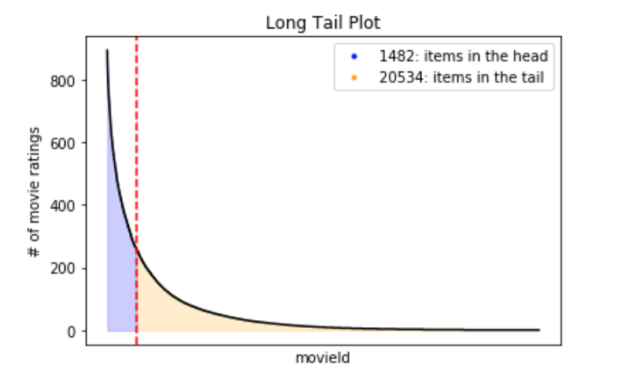
</p>

The items in the "long tail" usually do not have enough interactions to accurately be recommended using user-based recommender systems like collaborative filtering due to inherent popularity bias in these models and data sparsity. Many recommender systems require a certain level of sparsity to train. A good recommender must balance sparsity requirements with popularity bias.

## Mar@K and Map@K

```python
recmetrics.mark()

recmetrics.mark_plot()

recmetrics.mapk_plot()
```
Mean Average Recall at K (Mar@k) measures the recall at the kth recommendations. Mar@k considers the order of recommendations, and penalizes correct recommendations if based on the order of the recommendations. Map@k and Mar@k are ideal for evaluating an ordered list of recommendations. There is a fantastic implmentation of Mean Average Precision at K (Map@k) available [here](https://github.com/benhamner/Metrics), so I have not included it in this repo.

<p align="center">
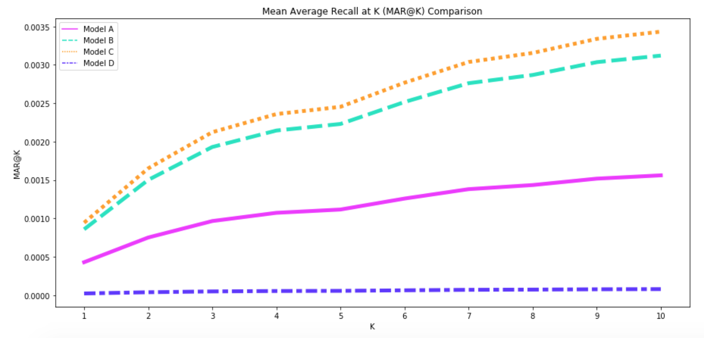
</p>

Map@k and Mar@k metrics suffer from popularity bias. If a model works well on popular items, the majority of recommendations will be correct, and Mar@k and Map@k can appear to be high while the model may not be making useful or personalized recommendations.

## Coverage

```python
recmetrics.prediction_coverage()

recmetrics.catalog_coverage()

recmetrics.coverage_plot()
```

Coverage is the percent of items that the recommender is able to recommend. It referred as prediction coverage and it's depicted by the next formula.

<p align="center">

</p>

Where 'I' is the number of unique items the model recommends in the test data, and 'N' is the total number of unique items in the training data.
The catalog coverage is the rate of distinct items recommended over a period of time
to the user. For this purpose the catalog coverage function take also as parameter 'k' the number of observed recommendation lists. In essence, both of metrics quantify the proportion of items that the system is able to work with.

<p align="center">
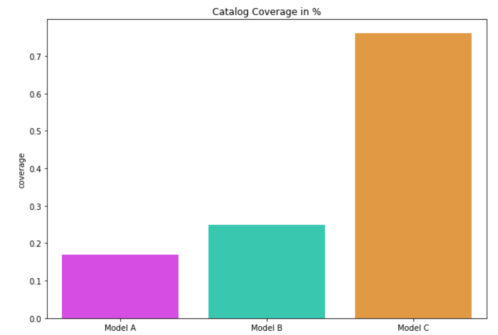
</p>

## Novelty

```python
recmetrics.novelty()
```

Novelty measures the capacity of recommender system to propose novel and unexpected items which a user is unlikely to know about already. It uses the self-information of the recommended item and it calculates the mean self-information per top-N recommended list and averages them over all users. 

<p align="center">
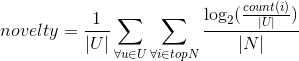
</p>

Where the absolute U is the number of users, count(i) is the number of users consumed the specific item and N is the length of recommended list.

## Personalization

```python
recmetrics.personalization()
```

Personalization is the dissimilarity between user's lists of recommendations.
A high score indicates user's recommendations are different).
A low personalization score indicates user's recommendations are very similar.

For example, if two users have recommendations lists [A,B,C,D] and [A,B,C,Y], the personalization can be calculated as:

<p align="center">
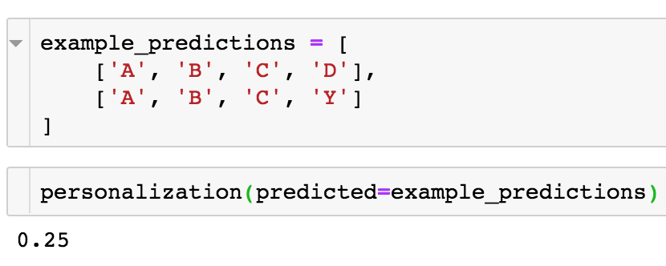
</p>

## Intra-list Similarity

```python
recmetrics.intra_list_similarity()
```

Intra-list similarity uses a feature matrix to calculate the cosine similarity between the items in a list of recommendations.
The feature matrix is indexed by the item id and includes one-hot-encoded features.
If a recommender system is recommending lists of very similar items, the intra-list similarity will be high.

<p align="center">
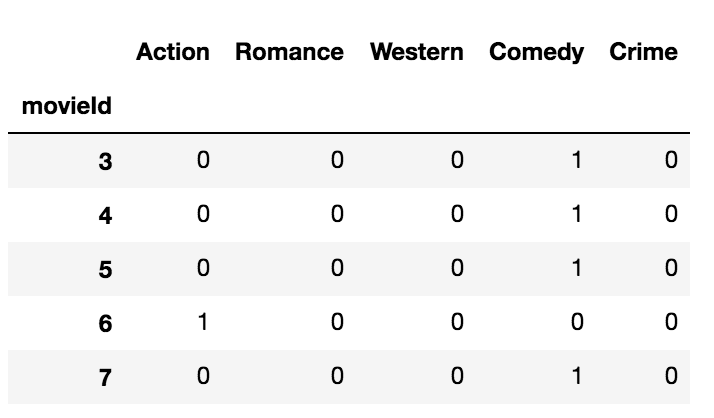
</p>

<p align="center">
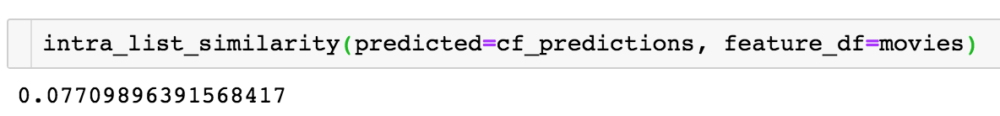
</p>

## MSE and RMSE

```python
recmetrics.mse()
recmetrics.rmse()
```

Mean Squared Error (MSE) and Root Mean Squared Error (RMSE) are used to evaluate the accuracy of predicted values yhat such as ratings compared to the true value, y.
These can also be used to evalaute the reconstruction of a ratings matrix.

<p align="center">
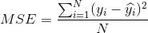
</p>

<p align="center">
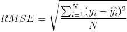
</p>

## Predicted Class Probability Distribution Plots

```python
recmetrics.class_separation_plot()
```


This is a plot of the distribution of the predicted class probabilities from a classification model. The plot is typically used to visualize how well a model is able to distinguish between two classes, and can assist a Data Scientist in picking the optimal decision threshold to classify observations to class 1 (0.5 is usually the default threshold for this method). The color of the distribution plots represent true class 0 and 1, and everything to the right of the decision threshold is classified as class 0.

<p align="center">
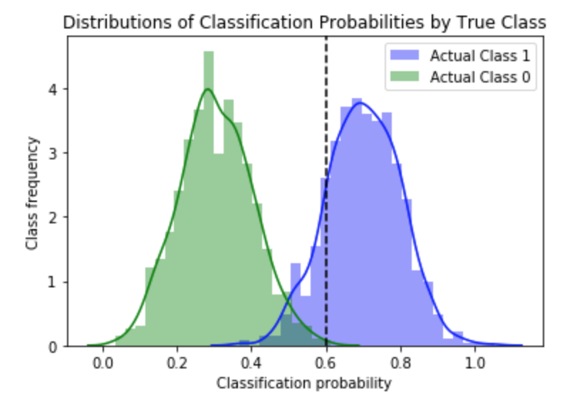
</p>

This plot can also be used to visualize the recommendation scores in two ways. 

In this example, and item is considered class 1 if it is rated more than 3 stars, and class 0 if it is not. This example shows the performance of a model that recommends an item when the predicted 5-star rating is greater than 3 (plotted as a vertical decision threshold line). This plot shows that the recommender model will perform better if items with a predicted rating of 3.5 stars or greater is recommended. 

<p align="center">
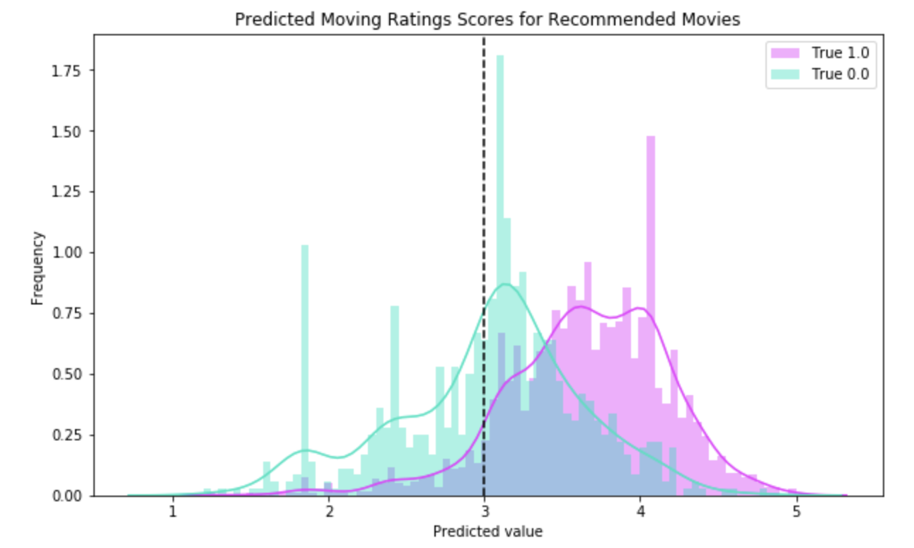
</p>

The raw predicted 5 star rating for all recommended movies could be visualized with this plot to see the optimal predicted rating score to threshold into a prediction of that movie. This plot also visualizes how well the model is able to distinguish between each rating value. 

<p align="center">

</p>

## ROC and AUC

```python
recmetrics.roc_plot()
```

The Receiver Operating Characteristic (ROC) plot is used to visualize the trade-off between true positives and false positives for binary classification. The Area Under the Curve (AUC) is sometimes used as an evaluation metrics. 

<p align="center">
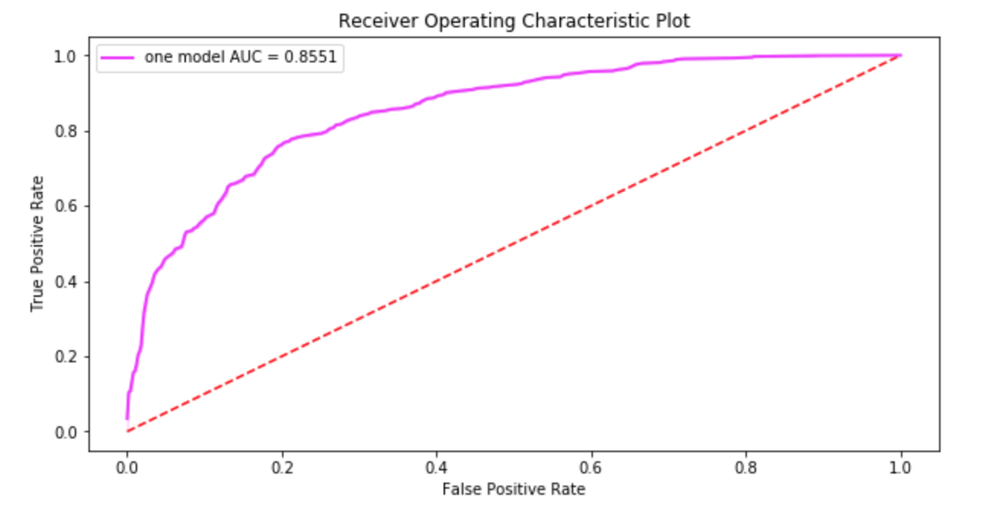
</p>

## Recommender Precision and Recall
```python
recmetrics.recommender_precision()
recmetrics.recommender_recall()
```

Recommender precision and recall uses all recommended items over all users to calculate traditional precision and recall. A recommended item that was actually interacted with in the test data is considered an accurate prediction, and a recommended item that is not interacted with, or received a poor interaction value, can be considered an inaccurate recommendation. The user can assign these values based on their judgment. 

## Precision and Recall Curve

```python
recmetrics.precision_recall_plot()
```

The Precision and Recall plot is used to visualize the trade-off between precision and recall for one class in a classification.

<p align="center">
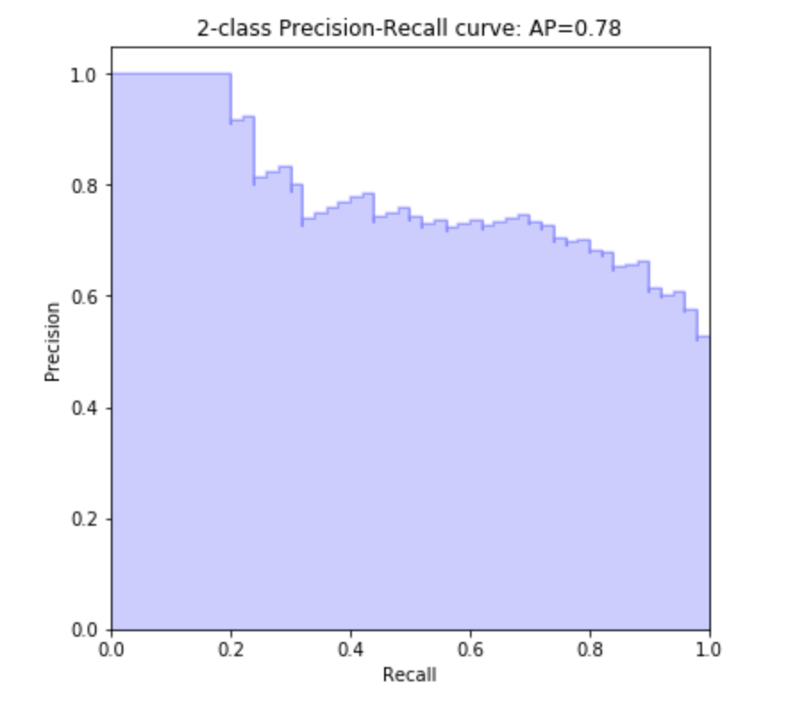
</p>

## Confusion Matrix

```python
recmetrics.make_confusion_matrix()
```

Traditional confusion matrix used to evaluate false positive and false negative trade-offs.

<p align="center">
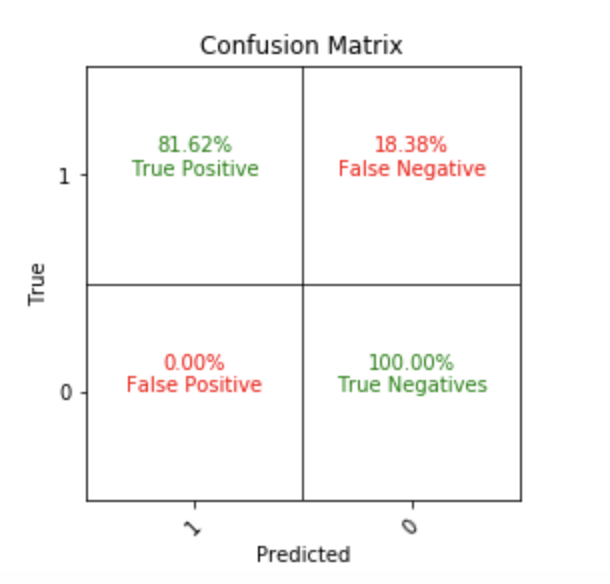
</p>

